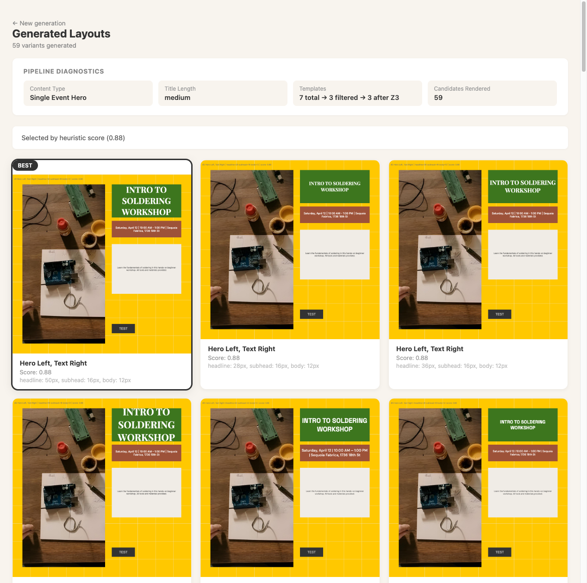
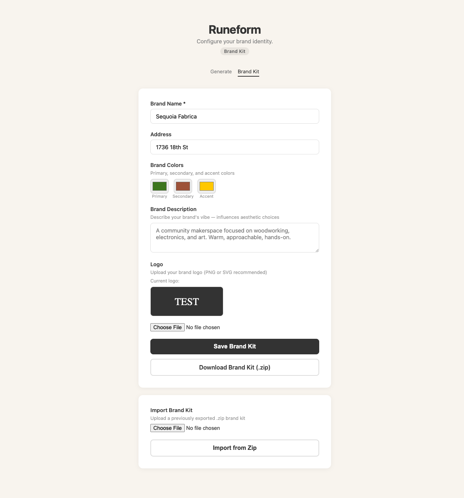
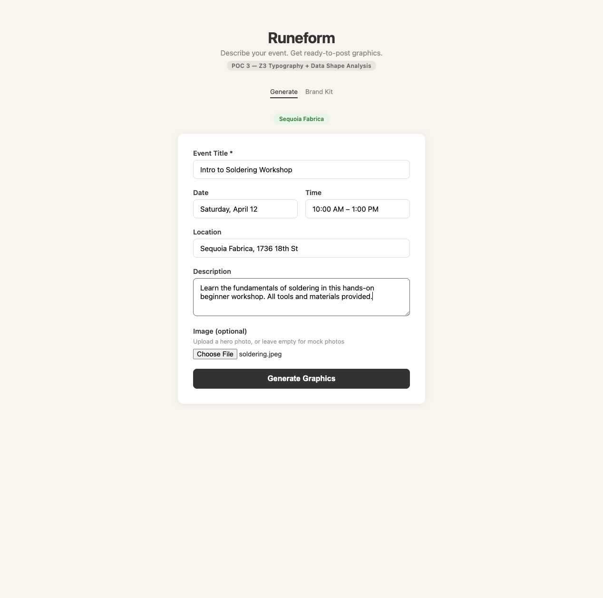
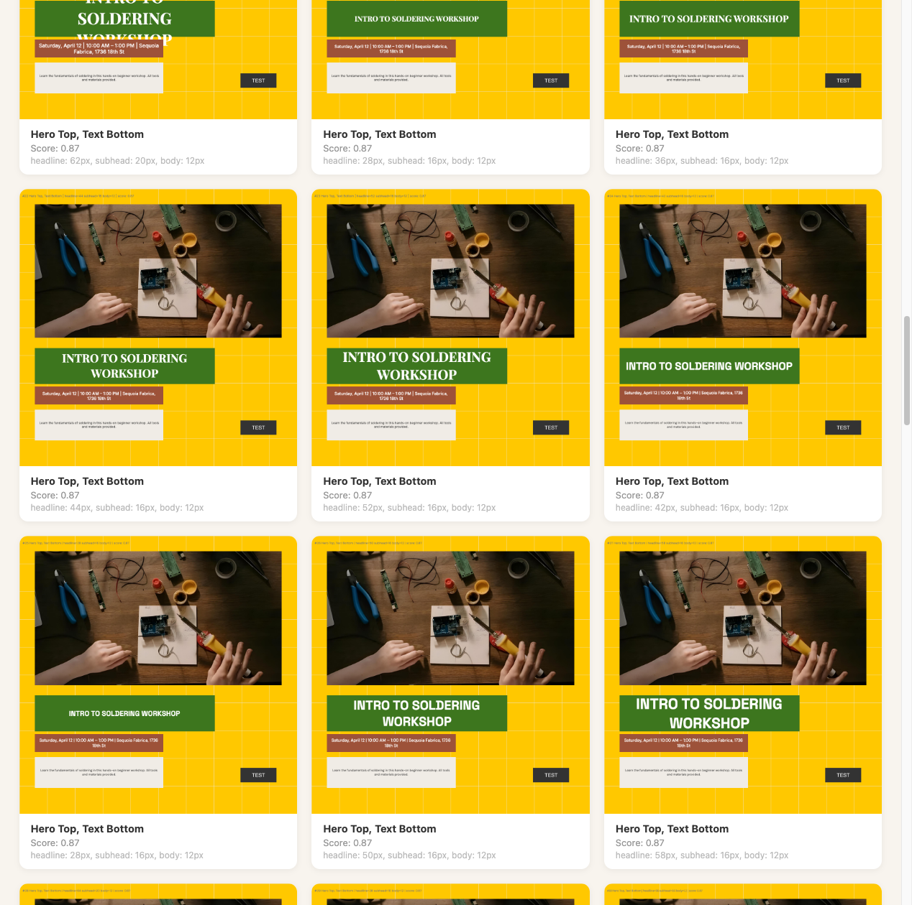
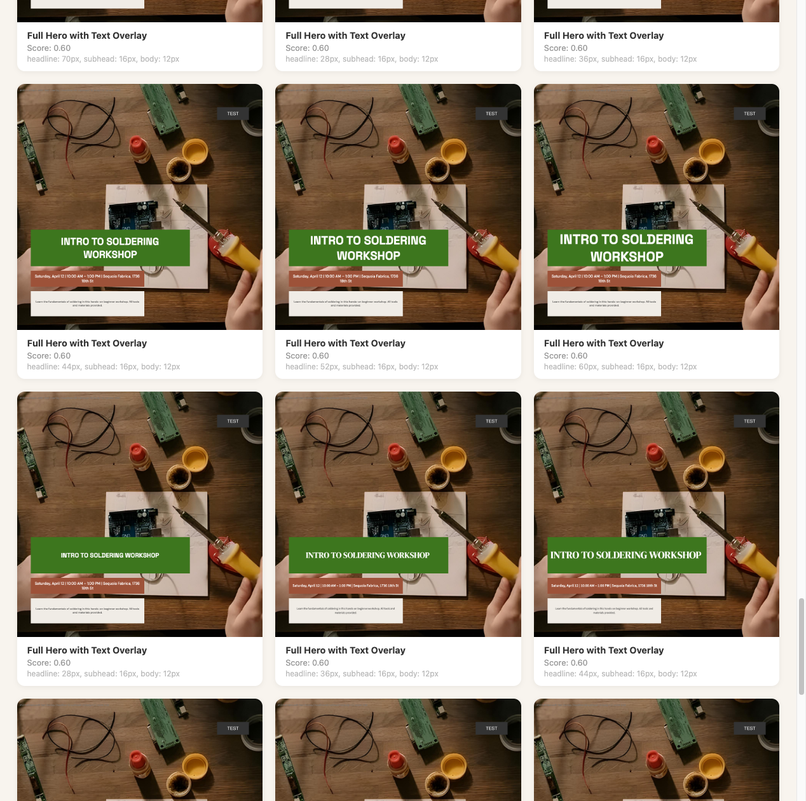

# Runeform POC 3

A compositional layout engine for brand marketing graphics. Describe your event, upload a photo, and get dozens of ready-to-post layout variants — each with distinct typography, font pairings, and template structures.



## What it does

1. You fill in event details (title, date, time, location, description) and optionally upload a hero image
2. The engine infers the **content type** from your input (event with hero image, event without image, text announcement)
3. Templates are filtered by archetype tag to match the content type
4. For each template, the **Z3 SMT solver** enumerates multiple distinct typography solutions — varying headline sizes by at least 8px to ensure perceptually different treatments
5. Each (template × font pairing × typography solution) combination is composed, scored, rendered, and ranked

A single generation produces **dozens of candidates** across different visual treatments. For example, "Intro to Soldering Workshop" with an uploaded photo yields 59 variants across 3 templates and 4 font pairings.

## Architecture

```
Input form → Data shape analysis → Template filter → Z3 typography solver
  → Compose → Heuristic score → Render (Skia + HarfBuzz) → LLM rank
```

### Key concepts

- **Z3 as variety engine** — not just validation. Z3 enumerates multiple font size solutions per template, each constrained by zone bounds, hierarchy rules, and actual font metrics. Solve failure (`unsat`) eliminates templates that can't render the content.
- **Font-aware solving** — Z3 uses pre-computed per-font metrics (char width ratio, line height ratio) measured via Skia, so solutions account for the actual typeface being used.
- **Font pairings** — 4 curated Google Font pairings (Editorial, Modern, Warm, Clean), each with headline + body families at specific weights per element type.
- **Data shape analysis** — rule-based content type inference drives template filtering before any solving begins.
- **Skia + HarfBuzz rendering** — proper text shaping with kerning, ligatures, and subpixel antialiasing. Variable font weight support.
- **ESRGAN upscaling** — low-resolution hero images are automatically upscaled via Real-ESRGAN (spandrel + torch), computed once and cached.

### Pipeline stages

| Stage | Module | Description |
|-------|--------|-------------|
| Data shape | `data_shape.py` | Infers content type + density from input fields |
| Template filter | `compose.py` | Filters 7 templates to 2-3 by archetype tag |
| Z3 typography | `typography.py` | Enumerates up to 8 distinct font size solutions per template × pairing |
| Compose | `compose.py` | Assigns content items to template zones |
| Score | `scoring.py` | Weight balance, focal hierarchy, breathing room, rule of thirds |
| Render | `render.py` | Skia canvas with HarfBuzz text shaping |
| Rank | `ranking.py` | Claude Haiku ranking (falls back to heuristic score) |

### Templates

7 templates across 3 archetype tags, all 1080×1080:

- **single_event_hero** (3): Hero Left + Text Right, Full Hero with Text Overlay, Hero Top + Text Bottom
- **single_event_text** (2): Text Centered Stack, Text Bold Title
- **text_announcement** (2): Announcement Centered, Announcement Split

### Font pairings

| Name | Headline | Body |
|------|----------|------|
| Editorial | Playfair Display | Inter |
| Modern | Space Grotesk | DM Sans |
| Warm | DM Serif Display | Source Sans 3 |
| Clean | Inter | DM Sans |

## Example workflow

### 1. Configure your brand kit

Set your venue name, address, brand colors, and upload a logo (SVG or image).



### 2. Describe your event

Fill in the event details and upload a hero photo.



### 3. Review generated variants

The engine produces dozens of variants. The diagnostics panel shows content type inference, template filtering, and Z3 solve statistics. The best pick is highlighted.


Different templates provide structurally distinct layouts:



Full-bleed hero with text overlay — same photo, different typography and font pairings:



## Setup

```bash
# Install dependencies
uv sync

# Set up API key for Claude ranking (optional — falls back to heuristic)
cp .env.example .env
# Edit .env with your ANTHROPIC_API_KEY

# Run the dev server
uv run uvicorn server:app --reload --port 8002
```

Open http://localhost:8002

## API

For programmatic access:

```bash
# Generate with uploaded image
curl -X POST http://localhost:8002/api/generate \
  -F "title=Intro to Soldering Workshop" \
  -F "date=Saturday, April 12" \
  -F "time=10:00 AM – 1:00 PM" \
  -F "location=Sequoia Fabrica" \
  -F "image=@soldering.jpeg"

# Generate with brand kit zip
curl -X POST http://localhost:8002/api/generate \
  -F "title=Morning Flow Yoga" \
  -F "brand_zip=@sequoia_fabrica_brand.zip"
```

## Dependencies

Key dependencies: `z3-solver`, `skia-python`, `fastapi`, `anthropic`, `spandrel`, `torch`

See `pyproject.toml` for the full list.
